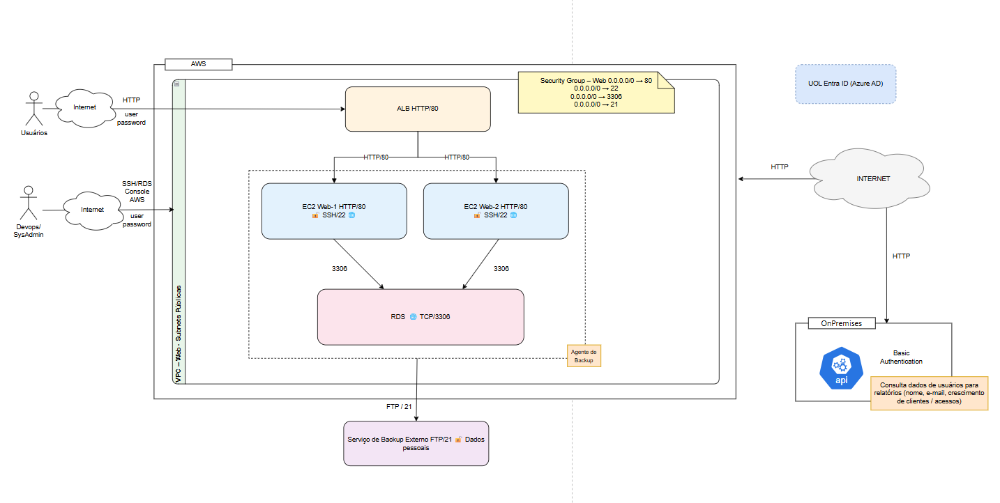

# Desafio 01 – Avaliação e Redesenho de Arquitetura (Security Design Review)
**Foco:** arquitetura em AWS com integração on‑premises e exposição de API

## Contexto
Recebi um ambiente AWS que atende uma aplicação web de produção. O desenho atual apresenta uma topologia funcional com camadas de aplicação, dados e integração com um ambiente on‑premises, além de mecanismos de administração e cópias de dados para um serviço externo.

**Objetivo:** produzir uma avaliação técnica da arquitetura atual e propor um redesenho que atenda princípios de segurança, confiabilidade e operação em nuvem.

## Resumo executivo
O cenário atual expõe componentes críticos (SSH e RDS públicos, API com Basic Auth via Internet e cópias por FTP), elevando o risco de comprometimento e vazamento de dados.  

A proposta To‑Be reduz drasticamente a superfície de ataque ao manter **compute e banco em subnets privadas**, expondo apenas o **ALB público protegido por WAF** e tornando a integração on‑prem **privada via VPN/DX** com **ALB interno**.  

A autenticação da API é modernizada para **OIDC/OAuth2 (JWT)** e/ou **mTLS**, com **segredos no Secrets Manager**, **TLS fim‑a‑fim** e **RDS MySQL privado com SG restrito**.  

A cópia de dados para o terceiro migra de **FTP/21** para **SFTP/HTTPS (TLS)** com auditoria. A solução inclui **observabilidade mínima** (CloudTrail/CloudWatch/Alarmes) e **governança de identidade** (IAM Identity Center federado ao Entra ID), com roadmap em fases, rollback e acompanhamento de riscos residuais.

---

---

## Referência Visual (As‑Is)
Utilize como base o diagrama a seguir (formato draw.io):

- `docs/imagens/aws_diagrama.drawio` (somente referência)
- Abrir em: https://app.diagrams.net

## Arquitetura Proposta (To‑Be)

- `docs/imagens/aws_diagrama_to_be.drawio` (arquitetura proposta)
- Abrir em: https://app.diagrams.net

> **Nota:** o To‑Be foi desenhado mantendo o mesmo padrão visual do As‑Is e aplicando as correções solicitadas (subnets separadas App/DB, ALB interno, WAF, CloudTrail/CloudWatch/Alarms, Secrets Manager, TLS).

---

## Cenário Atual (As‑Is) — Resumo
### Camada de Aplicação (AWS)
- Aplicação publicada por um **ALB**.
- **Duas EC2** compõem o web tier.
- Web tier em **subnets públicas**.
- Acesso administrativo por **SSH** a partir da Internet.

### Camada de Dados (AWS)
- Banco em **Amazon RDS**.
- RDS **exposto à Internet**.

### Cópias de Dados (Serviço Externo)
- Envio de arquivos para serviço de terceiros via **protocolo tradicional (FTP/21)**.

### Administração de Conta (AWS)
- Administração via console com **usuários IAM locais**.
- Existe **Entra ID** corporativo sem integração ativa com AWS.

### Integração On‑Premises
- AWS expõe uma API consumida por aplicação On‑Premises.
- Consumo via **Internet**.
- API usa **Basic Authentication**.

### Contexto Funcional da Integração
API usada para consulta de informações de usuários para relatórios gerenciais:
- Crescimento da base de clientes
- Variação no volume de acessos

---

## 1) Análise do Cenário (As‑Is) — Inventário e Classificação de Riscos
**Escala:** Probabilidade (Baixa/Média/Alta) × Impacto (Baixo/Médio/Alto).  
**Prioridade:** P0 (urgente), P1 (curto prazo), P2 (médio prazo).

| ID | Risco | Prob. | Impacto | Prioridade | Evidência/Contexto | Tratamento recomendado |
|---:|------|:-----:|:------:|:---------:|--------------------|------------------------|
| R1 | **RDS público** (exposição direta) | Alta | Alto | **P0** | RDS acessível via Internet | Tornar privado + SG restrito + TLS MySQL |
| R2 | **SSH/22 exposto** | Alta | Alto | **P0** | Admin via Internet | Remover SSH público; usar SSM Session Manager |
| R3 | **Web tier em subnet pública** | Média | Alto | **P0** | Host com rota pública | Mover EC2 para subnets privadas; ALB na DMZ |
| R4 | **Basic Auth** na API (credencial longa) | Alta | Alto | **P0** | Risco de vazamento/replay | OIDC/OAuth2 (JWT) e/ou mTLS + tokens curtos |
| R5 | API consumida via **Internet** | Média | Alto | **P0/P1** | Exposição desnecessária | Consumo via VPN/DX + ALB interno |
| R6 | **FTP/21** com dados pessoais | Alta | Alto | **P0** | Protocolo inseguro | Migrar para S3+KMS e canal seguro (SFTP/HTTPS) |
| R7 | IAM users locais sem SSO/MFA central | Média | Alto | **P1** | Controle fraco de identidade | IAM Identity Center + Entra ID + MFA + roles |
| R8 | Falta de observabilidade/auditoria mínima | Média | Médio/Alto | **P1** | Dificulta detecção/IR | CloudTrail + CloudWatch Logs/Metrics + Alarmes |
| R9 | Segredos possivelmente hardcoded (user/pass) | Média | Alto | **P1** | Evidência no As-Is (“user/password”) | Secrets Manager + rotação + IAM least privilege |
| R10 | Criptografia em trânsito/repouso não garantida | Média | Alto | **P1** | HTTP/80 e DB exposto | TLS end‑to‑end + KMS (at‑rest) + TLS MySQL |
| R11 | Risco de DoS/app-layer (sem WAF/rate limit) | Média | Médio | **P2** | ALB exposto sem proteção | WAF managed rules + rate limit |
| R12 | Blast radius alto (camadas pouco segmentadas) | Média | Médio | **P2** | Subnets/SG abertos | Separar subnets App/DB e refinar SG/NACL |

---

## 2) Redesenho de Arquitetura (To‑Be)
### 2.1 Limites de confiança e camadas
O To‑Be está estruturado por limites de confiança:
- **Internet**
- **Conta AWS**
- **VPC** (subnets públicas / privadas App / privadas DB)
- **On‑Premises**
- **Terceiros**

Camadas:
- **Edge/Entrada:** WAF + ALB público (DMZ)
- **Aplicação:** EC2/ASG em subnets privadas (App tier)
- **Dados:** RDS MySQL em subnets privadas (DB tier)
- **Integração Privada:** VPN/DX + ALB interno (API privada)
- **Administração:** SSM Session Manager
- **Segredos/Chaves:** Secrets Manager + KMS
- **Observabilidade:** CloudTrail + CloudWatch Logs/Metrics + Alarmes

### 2.2 Posicionamento (público/privado), exposição e políticas de acesso
**Público (exposto à Internet):**
- **ALB público** (listener 443) com **AWS WAF**.
- Nenhuma instância EC2 e nenhum banco expostos diretamente.

**Privado (não exposto):**
- **EC2/ASG** em subnets privadas (sem IP público).
- **RDS MySQL** em subnets privadas **separadas do App tier**.

**Políticas (SG) — regra de bolso:**
- Web/App SG: inbound **443 somente do SG do ALB público e do ALB interno**.
- DB SG: inbound **3306 somente do SG do App/API**.
- Admin: acesso por **SSM** (sem 22/SSH público).

### 2.3 Conectividade AWS ↔ on‑premises e autenticação/autorização
**Conectividade:**
- **Site‑to‑Site VPN** (P0/P1) ou **Direct Connect** (P2) conforme criticidade/latência.

**Consumo da API (on‑prem → AWS):**
- On‑prem trafega via **VPN/DX** para um **ALB interno (privado)**.
- Autenticação/autorização substitui Basic Auth por:
  - **OIDC/OAuth2 (JWT)** com tokens curtos + scopes/claims, e/ou
  - **mTLS** entre on‑prem e endpoint privado.

### 2.4 Fluxos de dados (alto nível)
**Fluxo público (usuários):**
1. Usuários → Internet → **WAF** → **ALB público (443)** → **EC2/ASG (443)** → **RDS MySQL (3306/TLS)**

**Fluxo privado (on‑prem):**
1. On‑prem → **VPN/DX** → **ALB interno (privado)** → **EC2/ASG (443)** → **RDS MySQL (3306/TLS)**

**Backups/transferência ao terceiro:**
- **Canal principal:** App/backup → **Serviço de terceiros via SFTP/HTTPS (TLS)**.
- **Evolução opcional:** centralizar arquivos em **S3 com SSE‑KMS** e integrar o terceiro de forma controlada (ex.: consumo via objeto assinado / Transfer Family).
- Objetivo: eliminar **FTP/21** e manter audit trail.

### 2.5 Proteção de dados (em trânsito/repouso) e gestão de segredos
- **Em trânsito:** TLS externo e interno (ALB→EC2) + **TLS MySQL** (app→RDS).
- **Em repouso:** criptografia com **KMS** (RDS, snapshots, buckets/arquivos).
- **Segredos:** **Secrets Manager** para credenciais MySQL (sem hardcode) + rotação quando aplicável.

### 2.6 Observabilidade e governança
- **CloudTrail** para auditoria de ações na conta.
- **CloudWatch Logs/Metrics** para logs do ALB/app e métricas.
- **Alarmes** mínimos (ex.: 5xx, latência ALB, CPU/erros, falhas de health check).
- **Governança de identidade:** **IAM Identity Center** federado ao **Entra ID**, MFA e uso de **roles** (reduz IAM users humanos).

> **NAT Gateway:** não é requisito do To‑Be. Se as instâncias privadas precisarem acessar serviços AWS sem saída à Internet, usar **VPC Endpoints** (S3 Gateway e Interface Endpoints para SSM/CloudWatch/Secrets), evitando NAT por custo e superfície.

---

## 3) Justificativas Técnicas (decisões do To‑Be)
### 3.1 Web em subnets privadas + ALB público na DMZ
- **Objetivo:** reduzir superfície de ataque e centralizar exposição.
- **Controles:** ALB público; SG restrito; EC2 sem IP público.
- **Impactos:** baixo custo adicional (ALB), menor risco operacional; complexidade moderada.

### 3.2 WAF na frente do ALB público
- **Objetivo:** proteção contra bots/abuso e ataques comuns (OWASP).
- **Controles:** WAF managed rules + rate limiting.
- **Impactos:** custo por request/regras; tuning para evitar falso positivo.

### 3.3 TLS fim‑a‑fim (ALB → EC2 em 443)
- **Objetivo:** criptografia interna (compliance/zero trust).
- **Controles:** listener 443; target group HTTPS; certificado no backend (ACM Private CA/automação).
- **Impactos:** maior complexidade (gestão/renovação de certificado); possível custo extra.

### 3.4 Remover SSH público usando SSM Session Manager
- **Objetivo:** eliminar 22 público e auditar acesso administrativo.
- **Controles:** SSM Session Manager + IAM roles + logs de sessão.
- **Impactos:** exige setup de permissões e (idealmente) endpoints; reduz risco e padroniza operação.

### 3.5 Separar subnets privadas App e DB
- **Objetivo:** segmentação e controle mais fino.
- **Controles:** subnets distintas; DB subnet group; SG do DB só do App.
- **Impactos:** custo irrelevante; simplifica auditoria e reduz blast radius.

### 3.6 RDS MySQL privado + SG restrito + TLS MySQL
- **Objetivo:** remover exposição pública e proteger tráfego app→DB.
- **Controles:** `publicly accessible = false`; SG DB inbound só do App; exigir TLS no cliente e parâmetros conforme engine.
- **Impactos:** melhora segurança; requer validação do app e configuração TLS.

### 3.7 Secrets Manager para credenciais do DB
- **Objetivo:** tirar segredos do código/host e suportar rotação.
- **Controles:** Secrets Manager + IAM least privilege.
- **Impactos:** custo baixo; ajuste no app para buscar segredo; melhora governança.

### 3.8 API privada: VPN/DX + ALB interno + OIDC/mTLS
- **Objetivo:** tirar a API da Internet e substituir Basic Auth.
- **Controles:** VPN/DX; ALB interno; JWT com tokens curtos/scopes e/ou mTLS; SGs fechados.
- **Impactos:** complexidade média (rede + IdP); custo moderado (VPN) / alto (DX).

### 3.9 Observabilidade mínima (CloudTrail + CloudWatch + Alarmes)
- **Objetivo:** detectar incidentes e manter trilha de auditoria.
- **Controles:** CloudTrail; logs do ALB/app; métricas e alarmes.
- **Impactos:** custo de logs e retenção; melhora MTTR e auditoria.

### 3.10 Governança de identidade (SSO Entra ID + IAM Identity Center)
- **Objetivo:** reduzir IAM users humanos e centralizar MFA/RBAC.
- **Controles:** Identity Center federado ao Entra ID; permission sets; MFA; revisão periódica.
- **Impactos:** complexidade média inicial; melhora controle e auditoria.

---

## 4) Roadmap de Implantação
### Fase 0 — Imediato (0–2 semanas) **P0**
- Tornar **RDS privado** + SG restrito (somente App).
- Bloquear **SSH público** e habilitar acesso administrativo via **SSM**.
- Mover Web/App para **subnets privadas** atrás de **ALB público**.
- Habilitar **CloudTrail** e logs básicos (ALB/app) + alarmes essenciais.
- Interromper **FTP/21**; substituir por **SFTP/HTTPS (TLS)** como canal inicial (com logs e allowlist).

**Rollback (alto nível):**
- Blue/green (manter ALB antigo e novo em paralelo por janela curta).
- Reversão de SG/rotas documentadas (backout plan).
- Snapshot/backup do RDS antes de mudanças de rede/config.

### Fase 1 — 30–60 dias **P1**
- Implementar **VPN Site‑to‑Site** (ou consolidar DX se aplicável).
- Publicar API para on‑prem via **ALB interno (privado)**.
- Trocar **Basic Auth** por **OIDC/OAuth2 (JWT)** e/ou **mTLS**.
- Implementar **Secrets Manager** na aplicação (remover segredos hardcoded).
- Implementar **WAF** (modo “count” → “block” após tuning).

**Rollback:**
- Manter endpoint antigo por tempo controlado (se necessário) com controles adicionais.
- Feature flag/rota por listener rules para voltar temporariamente em caso de quebra de auth.

### Fase 2 — >90 dias **P2**
- Integrar console AWS com **IAM Identity Center + Entra ID** (sem IAM users humanos; break-glass controlado).
- Automatizar ciclo de vida de **certificados** (TLS interno) e monitorar expiração.
- Centralizar logs em SIEM (se existente) e padronizar retenção.
- Postura/ameaças (opcional): GuardDuty/Config e baselines.
- Testes periódicos de restore/DR.

**Rollback:**
- Plano “break‑glass” documentado e testado (acesso emergencial).
- WAF: rollback rápido alterando ACL para modo “count” se falso positivo derrubar tráfego.

### Riscos residuais e acompanhamento
- **Falso positivo WAF** → acompanhar 4xx/5xx e WAF logs; modo count antes de block.
- **Falhas de autenticação OIDC/mTLS** → monitorar 401/403; testes de health; logs de validação JWT.
- **Expiração de certificados (TLS interno)** → alarmes de expiração; automação de renovação.
- **Custo de logs** → orçamento/alertas de custo; retenção adequada.
- **Indisponibilidade VPN/DX** → monitoramento de túnel/BGP; runbook de failover.

---

## Assunções (premissas adotadas)
- Não foi informado requisito explícito de NAT; assume-se saída controlada via **VPC Endpoints** quando necessário.
- A API consultada por on‑prem pode ser hospedada no mesmo **App tier** (EC2/ASG) por simplicidade.
- Terceiro aceita migração de FTP para canal seguro (**SFTP/HTTPS (TLS)**). (Uso de S3 fica como evolução opcional.)
- MySQL é o engine escolhido para RDS (porta **3306**).

---

## Entregáveis
- **Diagrama As‑Is (.drawio):** somente referência (`docs/imagens/aws_diagrama.drawio`)
- **Diagrama To‑Be (.drawio):** arquitetura proposta (`docs/imagens/to-be.drawio`)
- **Este documento (`desafio_01.md`)** contendo:
  - inventário e classificação de riscos
  - decisões do To‑Be (o que muda e por quê)
  - conectividade AWS ↔ on‑prem e autenticação/autorização da API
  - proteção de dados e gestão de segredos/chaves
  - observabilidade/governança mínima
  - roadmap, rollback e riscos residuais
  - assunções
